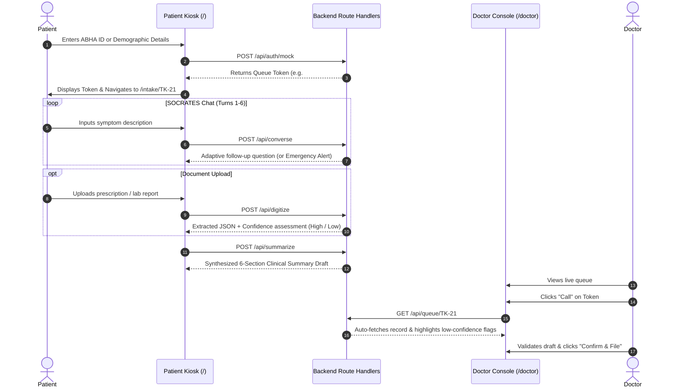

# MediKiosk

An intelligent outpatient intake and clinical triage system designed to streamline patient registration, conduct structured symptom inquiries using the clinical SOCRATES framework, digitize medical records with handwriting confidence scoring, and automatically feed synthesized summaries into a physician's EMR console.

---

## Overview

Hospital outpatient departments frequently face high intake volumes, leading to long queues, repetitive administrative intake steps, and fragmented patient history collection.

**MediKiosk** provides a dual-interface solution:
1. **Patient Kiosk (`/`)**: An intuitive touch-friendly intake terminal where patients authenticate via ABHA ID or walk-in registration, receive an assigned queue token, undergo an adaptive symptom interview, and upload prior prescriptions or diagnostic reports.
2. **Doctor EMR Console (`/doctor`)**: A clinical workstation interface that integrates with the queue system. When a doctor calls a token, MediKiosk automatically fetches the structured intake summary, highlighting any low-confidence handwritten prescriptions for physical verification.

---

## Features

### 1. Patient Identification & Queue Token Assignment
- **ABHA Identification**: Simulated 14-digit Ayushman Bharat Health Account (`14-XXXX-XXXX-XXXX`) OTP verification flow.
- **Walk-In Registration**: Rapid entry with basic demographics (name, phone, age, gender) for patients without an ABHA ID.
- **Token Linkage**: Generates a unified queue token (e.g. `#TK-21`) that links chat transcripts, digitized documents, and synthesized summaries across the entire workflow.

### 2. Adaptive SOCRATES Symptom Interview
- **Structured Inquiry**: Follows the clinical **SOCRATES** framework (*Site, Onset, Character, Radiation, Associations, Timing, Exacerbating/Relieving factors, Severity*).
- **Single-Question Adaptation**: Dynamically formulates one targeted follow-up question at a time based on patient responses.
- **Red-Flag Emergency Detection**: Automatically scans for critical emergency symptoms (*e.g., chest pain, acute breathlessness, fainting, stroke signs*), immediately halts standard interview flow, and triggers an urgent triage advisory banner.

### 3. Medical Document Digitization & Handwriting Confidence
- **Multimodal Optical Extraction**: Digitizes uploaded prescriptions and lab reports to extract document type, date, medications (with strength and frequency), and diagnoses.
- **Handwriting Legibility Assessment**: Differentiates between clear digital prints (*high confidence*) and ambiguous cursive handwriting (*low confidence*).
- **Physician Verification Flags**: Explicitly flags illegible medication lines or cursive abbreviations for physician verification rather than making unverified assumptions.

### 4. 6-Part Structured Clinical Summary
- Automatically aggregates interview transcripts and extracted document records into standard clinical documentation:
  1. **Chief Complaint**
  2. **History of Present Illness (HPI)**
  3. **Past Medical History**
  4. **Drug & Allergy History**
  5. **Family History**
  6. **Review of Systems (ROS)**
- Clearly marked as an **Editable Draft** pending clinical validation.

### 5. Physician EMR Console (`/doctor`)
- **Queue Station**: Real-time queue view tracking patient statuses (*Waiting*, *In Consultation*, *Completed*), wait times, and alert badges.
- **Token-Linked Auto-Fetch**: Calling a token automatically pulls and renders the patient's synthesized intake summary without manual lookup.
- **Visual Alert Indicators**: Prominent caution cards for red-flag symptoms and low-confidence handwritten documents.
- **Clinical Action Tools**: In-line draft editing and simulated "Confirm & File to EMR" action.

---

## Tech Stack

- **Framework**: [Next.js](https://nextjs.org/) (App Router, Server Components, Route Handlers)
- **UI & Styling**: [React](https://react.dev/), [Tailwind CSS](https://tailwindcss.com/), [Lucide React Icons](https://lucide.dev/)
- **Language**: [TypeScript](https://www.typescriptlang.org/)
- **Document & Language Models**: Google Generative AI SDK (`@google/generative-ai`) / Gemini 1.5 Flash
- **State & Storage**: In-memory repository with Next.js global state persistence

---

## Project Structure

```
medikiosk/
├── src/
│   ├── app/
│   │   ├── api/
│   │   │   ├── auth/mock/         # Simulated ABHA and patient check-in API
│   │   │   ├── converse/          # SOCRATES adaptive chat & red-flag evaluation API
│   │   │   ├── digitize/          # Multimodal document extraction & confidence API
│   │   │   ├── queue/             # Queue management & status update API
│   │   │   │   └── [token]/       # Token record retrieval API
│   │   │   └── summarize/         # 6-section clinical summary generator API
│   │   ├── doctor/                # Doctor EMR workstation console
│   │   ├── intake/[token]/        # Patient multi-step intake wizard (Chat, Upload, Summary)
│   │   ├── globals.css            # Custom styling and theme tokens
│   │   ├── layout.tsx             # Root application layout
│   │   └── page.tsx               # Patient check-in and ABHA login portal
│   ├── components/
│   │   └── kiosk/
│   │       ├── ClinicalSummaryView.tsx  # Structured summary card with draft notices
│   │       ├── DocumentUploader.tsx     # File dropzone & OCR confidence viewer
│   │       ├── KioskHeader.tsx          # Kiosk navigation header with token pill
│   │       └── SocratesChat.tsx         # Conversational intake interface
│   └── lib/
│       ├── gemini.ts              # Gemini client prompts & clinical fallback logic
│       ├── sampleDocs.ts          # Sample medical documents for OCR testing
│       ├── store.ts               # In-memory session and queue repository
│       └── types.ts               # TypeScript interfaces & data contracts
├── .env.local.example             # Environment variable template
├── next.config.ts                 # Next.js configuration
├── package.json                   # Project dependencies and scripts
├── tsconfig.json                  # TypeScript compiler configuration
└── README.md                      # Project documentation
```

---

## Getting Started

### Prerequisites

- **Node.js**: v18.17.0 or newer (v20+ recommended)
- **npm**: v9+ (or `pnpm` / `yarn`)

### Installation

1. Clone the repository:
   ```bash
   git clone https://github.com/by-ab/medikiosk.git
   cd medikiosk
   ```

2. Install dependencies:
   ```bash
   npm install
   ```

### Configuration

Create a `.env.local` file in the root directory by copying the template:

```bash
cp .env.local.example .env.local
```

Add your Google Gemini API key to `.env.local`:

```env
GEMINI_API_KEY=your_gemini_api_key_here
```

> **Note**: If `GEMINI_API_KEY` is omitted, the application automatically uses built-in clinical fallback state machines, allowing all UI flows, OCR tests, and summaries to function offline for local evaluation.

---

## Running Locally

1. Start the development server:
   ```bash
   npm run dev
   ```

2. Open the application in your browser:
   - **Patient Kiosk Portal**: [http://localhost:3000](http://localhost:3000)
   - **Physician EMR Console**: [http://localhost:3000/doctor](http://localhost:3000/doctor)

### Building for Production

To create an optimized production build:

```bash
npm run build
npm run start
```

---

## Usage Workflow



---

## Future Improvements

- **HL7 / FHIR Integration**: Native export of clinical summaries as standard FHIR `Composition` and `Observation` bundles.
- **Multilingual Audio/Voice Intake**: Speech-to-text intake supporting regional languages for enhanced accessibility.
- **Biometric Authentication**: Fingerprint/Iris verification for direct government health ID integration.
- **Persistent Database Layer**: PostgreSQL / Prisma adapter for multi-station hospital deployment.

---

## License

This project is licensed under the MIT License. See [LICENSE](LICENSE) for details.
